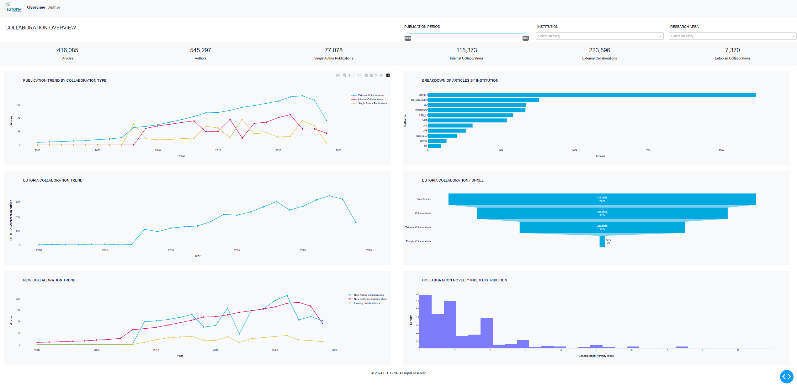
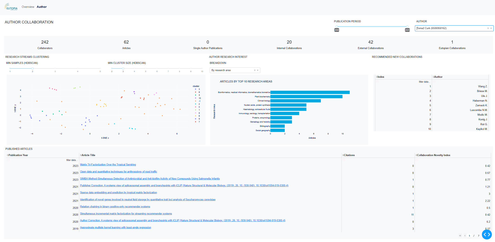

# EUTOPIA Collaboration Recommender: Analytical Layer

**Author:** [@lukazontar](https://github.com/lukazontar)

<hr/>

## Project Introduction

This repository contains the code for the EUTOPIA collaboration recommender system.

In today's academic landscape, collaboration across disciplines and institutions is crucial due to complex scientific
papers. Yet, such collaboration is often underused, leading to isolated researchers and few connected hubs. This thesis
aims to create a system for proposing new partnerships based on research interests and trends, enhancing academic
cooperation. It focuses on building a network from scientific co-authorships and a recommender system for future
collaborations. Emphasis is on improving the EUTOPIA organization by fostering valuable, interdisciplinary academic
relationships.

The system consist of three main components:

1. **Luigi pipeline for data ingestion and
   transformation**: [ecr-luigi :octocat:](https://github.com/eutopia-collaboration-recommender/ecr-luigi).
2. **Analytical layer for gaining a deeper understanding of the
   data**: [ecr-analytics :octocat:](https://github.com/eutopia-collaboration-recommender/ecr-analytics).
3. **Recommender system for proposing new
   collaborations**: [ecr-recommender :octocat:](https://github.com/eutopia-collaboration-recommender/ecr-recommender).

<hr/>

## Setting up the environment

Environment stack:

- Python, SQL as main programming languages.
- [PyMC](https://www.pymc.io/welcome.html) for Bayesian modeling. *Installed via conda*.
- [Dash](https://dash.plotly.com/) for building the analytical dashboard. *Installed via pip*.

### Prerequisites

- Docker
- Python 3.10 (using [pyenv](https://github.com/pyenv-win/pyenv-win)
  and [venv](https://docs.python.org/3/library/venv.html))
- [Conda](https://anaconda.org/anaconda/conda) (for PyMC)

To run notebooks and the dashboard, you need to install the dependencies. Since we're using PyMC, you need to create
and activate a Conda environment:

```bash
conda env create -f environment.yml
conda activate ecr-analytics-conda
```

## Notebooks

We've provided a few Jupyter notebooks for data exploration, which can be found in the `notebooks` directory. The
notebooks are thoroughly documented and provide insights into the data, which can be used for further analysis. Here's
a brief overview of the notebooks:

1. [Data coverage & quality](src/notebooks/01_data_coverage_and_quality.ipynb): an overview of the data coverage and
   quality in our data warehouse.
2. [Publication landscape](src/notebooks/02_publication_landscape.ipynb): an analysis of the publication landscape in
   the EUTOPIA organization that gives us a general overview of the ingested data.
3. [Occurrence of new collaborations](src/notebooks/03_occurrence_of_new_collaborations.ipynb): an analysis of the
   occurence of new collaborations in the EUTOPIA organization including collaboration novelty index and distribution of
   new collaborations over time.
4. [Research topics - top N articles distribution](src/notebooks/04_research_topics_top_n_articles_distribution.ipynb):
   an analysis of the distribution of top N articles for each research topic that are used for research area
   classification.
5. [New collaborations impact on author research direction](src/notebooks/05_new_collaborations_impact_on_author_research_direction.ipynb):
   an analysis of the impact of new collaborations on author's research direction.
6. [New collaborations are driven by research trends](src/notebooks/06_new_collaborations_are_driven_by_research_trends.ipynb):
   an analysis testing whether new collaborations are driven by research trends.
7. [New collaborations are driven by search for expertise](src/notebooks/07_new_collaborations_are_driven_by_search_for_expertise.ipynb):
   an analysis testing whether new collaborations are driven by the search for expertise.
8. [New collaborations are driven by experienced lead authors](src/notebooks/08_new_collaborations_are_driven_by_experienced_lead_authors.ipynb):
   an analysis testing whether new collaborations are driven by experienced lead authors.

## Dashboard

To run the analytical dashboard, you need to run the following command in the `src` directory:

```bash
python app.py
```

#### (optional) Caching the data using redis

If you want to cache the data using Redis, you need to setup a Redis server. We've provided a `docker-compose.yaml` file
for this purpose. You can run the following command to start the Redis server:

```bash
docker-compose up
```

This will store query results in Redis for 1 hour before fetching the data again, which results in faster loading times.

<hr/>

The analytical dashboard is built using Dash and provides insights into our data warehouse through two main tabs:

1. **Overview:** provides an overview of the publication landscape in the EUTOPIA organization.
2. **Author:** provides insights into research interest, streams and recommendations for new collaborations for a
   specific author.

### Overview page



### Author page

